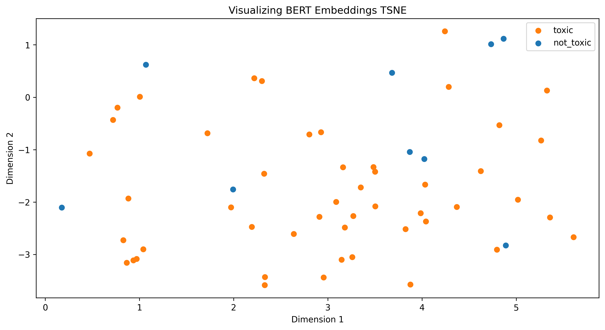

Multi-label text classification is a task in which a message is classified into multiple categories or labels. To achieve accurate classification, it is essential to perform exploratory data analysis (EDA) to gain insights, identify patterns and relationships, and validate assumptions. In this article, we will discuss the important EDA plots and figures for multi-label text classification, including label distribution, co-occurrence matrix, average sentence length distribution, n-gram frequency distribution, sentiment distribution, lexical diversity distribution, correlation between label properties, label similarity matrix, and reduced label embeddings.

## Introduction:

Multi-label text classification is a complex task that requires an understanding of the relationships between labels and the text features. EDA is a crucial step in this process as it helps to identify potential issues with the dataset and guide feature engineering and model selection decisions. In this article, we will discuss the important EDA plots and figures for multi-label text classification.

## Label Distribution:

The Label Distribution plot shows the distribution of labels in the dataset. It is a histogram that displays the frequency of each label in the dataset. This plot helps to understand the balance of the dataset and identify potential label imbalance. Imbalanced datasets can be a challenge for machine learning models as they tend to favor the majority class and may not be able to learn the minority class well. If the Label Distribution plot shows a significant imbalance in the dataset, one possible solution is to use techniques like data augmentation or sampling methods to balance the dataset and improve model performance.

**Caption: Distribution of labels in the dataset.**

## Label Co-Occurrence Heatmap:

The co-occurrence matrix shows the frequency with which pairs of labels occur together in the dataset. Analyzing the co-occurrence matrix can reveal the relationships between different labels and the prevalence of certain label combinations. By examining the co-occurrence matrix, we can also identify potential issues in our data. For instance, if a label is frequently co-occurring with many other labels, it could mean that the label is too broad or ambiguous and may need to be further refined or split into multiple labels. In summary, the co-occurrence matrix provides important insights into the relationships between labels in our dataset and can help guide our decision-making process when building a multi-label classifier.

Caption: Heatmap of label co-occurrence in the dataset.

## Average Sentence Length Distribution:

The Average Sentence Length Distribution plot shows the distribution of average sentence lengths for each label. This plot can give insight into how complex the messages are for each label and whether there is a significant difference in the complexity of messages across labels. If the messages for each label have significantly different levels of complexity, this could impact the performance of a multi-label classifier. Additionally, this plot can also help identify labels with messages that have particularly long or short average sentence lengths. This information can be used to identify labels that may need further investigation or refinement to improve the accuracy of the classifier.

**Caption: Distribution of average sentence lengths for messages with the "toxic" label.**

**Caption: Distribution of message lengths for messages with the "toxic" label.**

**Caption: Distribution of average sentence lengths for messages with the "not_toxic" label.**

**Caption: Distribution of message lengths for messages with the "not_toxic" label.**

## N-gram Frequency Distribution:

N-gram frequency distribution is a plot that shows the frequency of occurrence of each n-gram in the text. In the case of a multi-label classifier that uses messages to classify them, n-gram frequency distribution helps in identifying the important n-grams that are relevant to each label. If some labels have similar n-gram frequency distributions, it might indicate that the messages in those labels share some common vocabulary or phrases. On the other hand, if some labels have very distinct n-gram frequency distributions, it might suggest that the messages in those labels are very different in terms of their language and content. Overall, the n-gram frequency distribution plot helps in identifying the important n-grams in the text and their relevance to different labels.

**Caption: Frequency distribution of 1-grams (triplets of adjacent words) for messages with the "toxic" label.**

**Caption: Frequency distribution of 2-grams (triplets of adjacent words) for messages with the "toxic" label.**

**Caption: Frequency distribution of 3-grams (triplets of adjacent words) for messages with the "toxic" label.**

**Caption: Frequency distribution of 1-grams (triplets of adjacent words) for messages with the "not_toxic" label.**

**Caption: Frequency distribution of 2-grams (triplets of adjacent words) for messages with the "not_toxic" label.**

**Caption: Frequency distribution of 3-grams (triplets of adjacent words) for messages with the "not_toxic" label.**

## Sentiment Distribution:

The Sentiment Distribution plot is an important visualization that displays the distribution of sentiment across different labels. A positive sentiment score indicates that the message expresses positive emotions or opinions, while a negative score indicates negative emotions or opinions. Additionally, a score of 0 indicates a neutral sentiment. This plot provides a clear understanding of the sentiment distribution for each label, which can help us identify the types of messages associated with that label and gain insights into the overall sentiment of the dataset. For example, if a particular label has a high proportion of positive sentiment messages, it may indicate that messages associated with that label tend to be more positive in nature. This information can be useful for training a multi-label classifier. Furthermore, the overall sentiment distribution can also help to identify any biases towards certain types of messages, which can impact the accuracy of the model.

**Caption: Distribution of sentiment scores for messages with the "toxic" label.**

**Caption: Distribution of sentiment scores for messages with the "not_toxic" label.**

## Lexical Diversity Distribution:

Another important visualization in EDA is the Lexical Diversity Distribution plot, which displays the distribution of lexical diversity scores. Lexical diversity is the ratio of unique words to the total number of words in each message, and a higher score indicates a greater variety of vocabulary and potentially more complex language. This visualization provides insights into the language complexity of each label and the level of difficulty of the classification task. However, it is important to note that a high lexical diversity score does not necessarily mean that the language is more difficult to classify, as it could simply reflect the use of more specialized vocabulary in a particular domain. If one label consistently has a higher lexical diversity score compared to others, it could indicate that it is more challenging to classify due to the complexity of its language. Therefore, this plot can be used to gain a better understanding of the language characteristics of each label and potentially identify any labels that may require special attention in the classification process.

**Caption: Distribution of lexical diversity scores for messages with the "toxic" label.**

**Caption: Distribution of lexical diversity scores for messages with the "not_toxic" label.**

## Correlation Between Label Properties:

The Correlation Between Label Properties plot shows the correlation between different label properties, such as message length, sentiment, and lexical diversity, for each label. This plot helps us understand how label properties are related and identify any unique or shared correlations between labels. Interpreting the Correlation Between Label Properties plot can provide valuable insights into the relationships between different label properties. For example, if there is a high positive correlation between message length and lexical diversity score for a particular label, it suggests that longer messages are likely to have higher lexical diversity. On the other hand, if there is a high negative correlation between average sentence length and sentiment score for a particular label, it suggests that shorter sentences are likely to have more positive sentiment. Understanding the relationships between different label properties can be useful for improving the accuracy of a multi-label classifier by improving the feature representation for the classifier or sentiment analysis component.

**Caption: Heatmap of correlation coefficients between different label properties for messages with the "toxic" label.**

**Caption: Heatmap of correlation coefficients between different label properties for messages with the "not_toxic" label.**

## Label Similarity Matrix:

The Label Similarity Matrix plot visualizes the pairwise similarity between different labels in the dataset based on their feature representations. This plot helps us understand how labels are related and identify any clusters or patterns in the label space. It can also help identify potential label redundancy and inform label merging or splitting decisions. If two labels have a high similarity score, it may indicate that they are redundant and can be merged into a single label without significant loss of information. Conversely, if two labels have a low similarity score, it may indicate that they are distinct and should be kept separate.

**Caption: Heatmap of label similarity scores based on feature representations.**

## Reduced Label Embeddings

The Reduced Label Embeddings plot is a visualization of the low-dimensional embeddings of the labels obtained through dimensionality reduction techniques such as PCA or t-SNE. This plot helps to identify any patterns or clusters in the label space and visualize the relationships between the different labels in a 2D or 3D space.

By evaluating the Reduced Label Embeddings plot, we can gain a better understanding of the distribution of the labels and make informed decisions during the feature engineering and model selection phases of the multi-label classification task.

The Reduced Label Embeddings plot represents a reduced dimensional representation of the original label embeddings learned by the BERT model. This plot can be used to analyze and understand how the BERT model has learned to represent and cluster the different labels in the reduced dimensional space.

PCA and t-SNE are two popular techniques used for dimensionality reduction. In the PCA plot, we can observe the direction and strength of the correlations between the different label embeddings. The t-SNE plot, on the other hand, highlights the non-linear structure of the embeddings, enabling us to visualize the clusters and their separability.

Analyzing the Reduced Label Embeddings plot can provide valuable insights into the effectiveness of the BERT model in classifying the messages based on their multi-label classification. If the labels are well-separated in the reduced dimensional space, it indicates that the BERT model has learned a meaningful representation of the labels and can efficiently distinguish between them. However, if the labels are close to each other, it can indicate that the model is having difficulty distinguishing between them, and more training or fine-tuning may be necessary.

**Caption: Scatterplot of label embeddings in a reduced dimensional space obtained through.**

# Initial modeling analysis

| Task   | Model | Classifier | Hyperparameters | Metrics |
|--------|-------|------------|-----------------|---------|
| toxic | bert-base-cased | RandomForestClassifier | {"bootstrap": true, "ccp_alpha": 0.0, "class_weight": null, "criterion": "gini", "max_depth": 2, "max_features": "sqrt", "max_leaf_nodes": null, "max_samples": null, "min_impurity_decrease": 0.0, "min_samples_leaf": 1, "min_samples_split": 2, "min_weight_fraction_leaf": 0.0, "n_estimators": 50, "n_jobs": null, "oob_score": false, "random_state": null, "verbose": 0, "warm_start": false} | {"val_f1": 0.8000000000000002, "test_f1": 0.9090909090909091} || toxic | distilbert-base-uncased | RandomForestClassifier | {"bootstrap": true, "ccp_alpha": 0.0, "class_weight": null, "criterion": "gini", "max_depth": 2, "max_features": "sqrt", "max_leaf_nodes": null, "max_samples": null, "min_impurity_decrease": 0.0, "min_samples_leaf": 1, "min_samples_split": 2, "min_weight_fraction_leaf": 0.0, "n_estimators": 50, "n_jobs": null, "oob_score": false, "random_state": null, "verbose": 0, "warm_start": false} | {"val_f1": 0.9090909090909091, "test_f1": 0.9090909090909091} || toxic | bert-base-uncased | RandomForestClassifier | {"bootstrap": true, "ccp_alpha": 0.0, "class_weight": null, "criterion": "gini", "max_depth": 2, "max_features": "sqrt", "max_leaf_nodes": null, "max_samples": null, "min_impurity_decrease": 0.0, "min_samples_leaf": 1, "min_samples_split": 2, "min_weight_fraction_leaf": 0.0, "n_estimators": 50, "n_jobs": null, "oob_score": false, "random_state": null, "verbose": 0, "warm_start": false} | {"val_f1": 0.9090909090909091, "test_f1": 0.9090909090909091} |

# Summary

In conclusion, analyzing the Reduced Label Embeddings in PCA and t-SNE spaces can help in understanding the distribution of the labels in the reduced dimensional space and can provide valuable insights into the effectiveness of the BERT model in classifying the messages based on their multi-label classification.

Overall, by evaluating the different plots and figures presented in this EDA, we can gain a comprehensive understanding of the multi-label text classification dataset, including label distribution, label co-occurrence, language complexity, label similarity, and the effectiveness of the Transormer model. These insights can help guide our decisions in feature engineering and model selection and ultimately lead to the development of more accurate and effective multi-label classifiers.

It is worth noting that the list of plots and figures presented in this EDA is not exhaustive, and there may be other plots and analyses that can provide additional insights into the dataset. However, the set of plots and figures presented here covers a wide range of aspects that are crucial for the development of multi-label classifiers for text data.

In conclusion, Exploratory Data Analysis is an essential step in multi-label text classification, and the plots and figures presented in this article can help data scientists gain a better understanding of their dataset, validate assumptions, and make informed decisions in the feature engineering and model selection phases.
